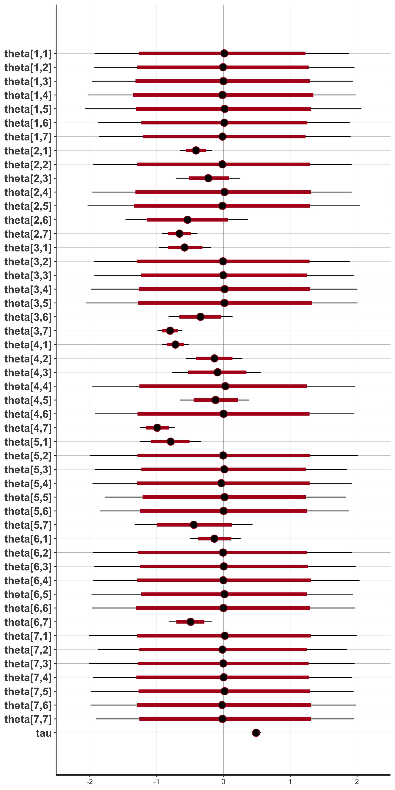

# Stan for Meta-Analysis

## Overview
This repository contains my Stan and R code that can be adapted for various Bayesian meta analyses (hierarchical models). Currently, it includes a random effects model and a network meta-analysis. Data for the random effects model is from a study on the effects of green tea on weight loss [^1] and collected by [^2]. Data for the network meta-analysis is from an analysis of the effectiveness of different cognitive behavioral therapies for depression, studied by [^3]. The data is formatted in the R package *dmetar* by [^4].

## Random Effects Model
The random effects model in the Stan script [meta_analysis_random_effect.stan](./code/meta_analysis_random_effect.stan) has the following form:

$$\hat{\theta_{k}} \sim Normal(\theta_{k}, \space \sigma^2 )$$

$$\theta_{k} \sim Normal(\mu, \tau^2)$$

with the priors:

$$\mu \sim Normal(0, 1)$$
$$\tau \sim HalfCauchy(0, 0.5)$$

A forest plot of the effects on weight loss is generated using the [plot_forest.R](./code/plot_forest.R) script, which creates a visual representation of the estimated effects and their credible intervals:

<!--  -->

A posterior predictive distribution of the mean difference, using 20 samples from the posterior distribution, is generated:

## Network Meta-Analysis
The scripts for the network meta-analysis are in [network_meta_analysis.R](./code/network_meta_analysis.R) and [network_meta_analysis.Stan](./code/network_meta_analysis.stan). The model we estimate is:

$$\hat{\theta_{k, ij}} \sim MVNormal(\theta_{k, ij}, \space \Sigma_k R \Sigma_k)$$

$$\theta_{k, ij} \sim MVNormal(\theta_{ij}, \space T)$$

where 

$$
\Sigma_k = 
\begin{bmatrix}
\sigma_{k,11} & 0 & 0 & \cdots & 0 \\
0 & \sigma_{k,22} & 0 & \cdots & 0 \\
0 & 0 & \sigma_{k,33} & \cdots & 0 \\
\vdots & \vdots & \vdots & \ddots & \vdots \\
0 & 0 & 0 & \cdots & \sigma_{k,nn}
\end{bmatrix},
$$

$$
R = 
\begin{bmatrix}
\rho & 1 & 1 & 1 \\
1 & \rho & 1 & 1 \\
1 & 1 & \rho & 1 \\
1 & 1 & 1 & \rho
\end{bmatrix},
$$

and 

$$
T = 
\begin{bmatrix}
\tau^2 & \tau^2/2 & \tau^2/2 & \tau^2/2 \\
\tau^2/2 & \tau^2 & \tau^2/2 & \tau^2/2 \\
\tau^2/2 & \tau^2/2 & \tau^2 & \tau^2/2 \\
\tau^2/2 & \tau^2/2 & \tau^2/2 & \tau^2
\end{bmatrix}, 
$$

with $\rho = 0.5$ and the same prior we used in the random effects model: 

$$\theta_{ij} \sim Normal(0, 1)$$
$$\tau \sim HalfCauchy(0, 0.5)$$

Part of the model for including indirect evidence and 3-arm studies is being developed, but below is the direct effects estimated by the code:

## References
[^1] Jurgens TM, Whelan AM, Killian L, Doucette S, Kirk S, Foy E. Green tea for weight loss and weight maintenance in overweight or obese adults. *Cochrane Database of Systematic Reviews 2012, Issue 12*.

[^2] Grant, R., & Di Tanna, G. L. (2025). *Bayesian meta-analysis: a practical introduction*. CRC Press.

[^3] Cuijpers, P., Noma, H., Karyotaki, E., Cipriani, A., & Furukawa, T. A. (2019). Effectiveness and acceptability of cognitive behavior therapy delivery formats in adults with depression: a network meta-analysis. *JAMA psychiatry, 76*(7), 700-707.

[^4] Harrer, M., Cuijpers, P., Furukawa, T.A., & Ebert, D.D. (2021). *Doing Meta-Analysis with R: A Hands-On Guide*. Boca Raton, FL and London: Chapman & Hall/CRC Press. ISBN 978-0-367-61007-4.