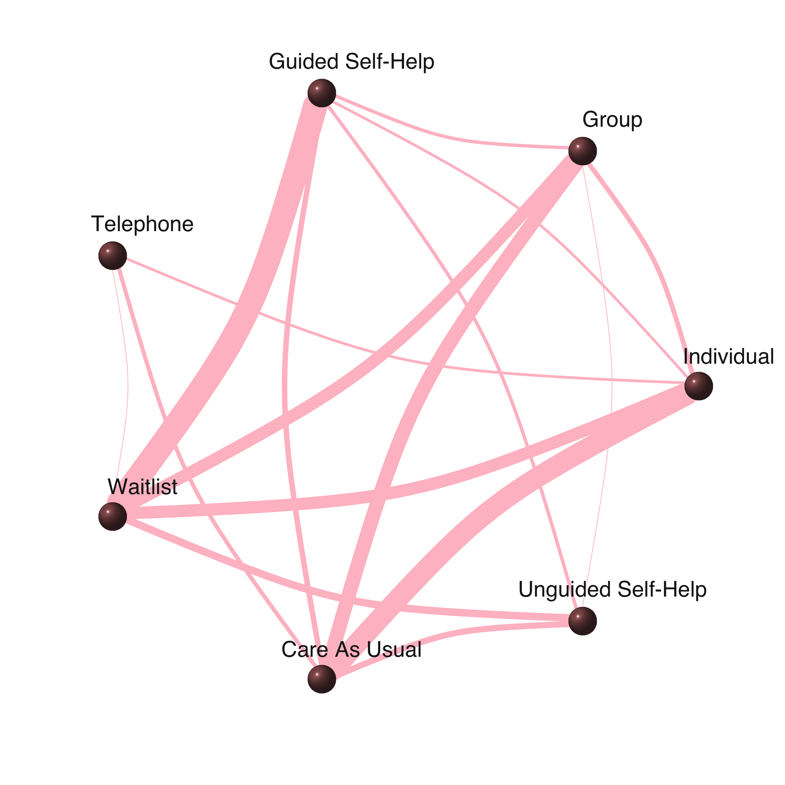
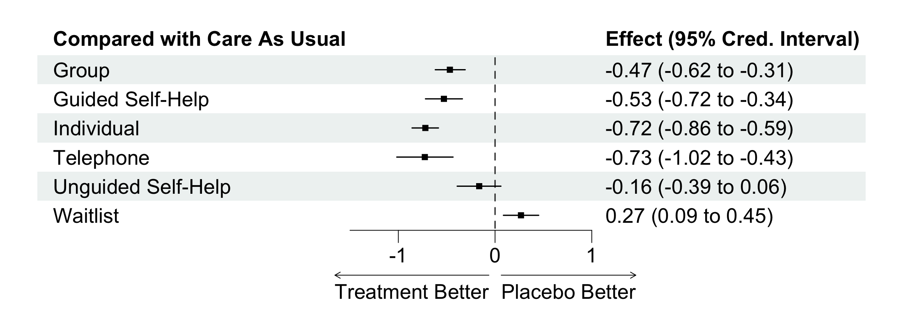
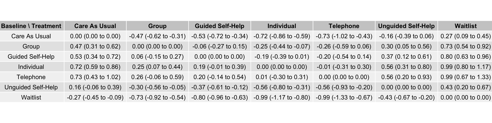

# Stan for Bayesian Meta-Analysis

## Overview

This repository contains Stan and R code for performing Bayesian meta-analyses (hierarchical models). Meta-analysis is a statistical method that combines results from multiple studies to estimate an overall effect. In a **random effects meta-analysis**, we assume that the true effect size may vary between studies due to differences in study populations or methods; this model accounts for such variability. A **network meta-analysis** extends this approach to compare a network of multiple treatments across studies, allowing for both direct and indirect comparisons between treatments.

Currently, the repository includes code for a random effects model and a random effects network meta-analysis (indirect treatment comparisons). The random effects model uses data from a study on the effects of green tea on weight loss [^1], collected by [^2]. The network meta-analysis uses data on the effectiveness of different cognitive behavioral therapies for depression, as studied by [^3]. The data is formatted in the R package *dmetar* by [^4].

 

## Random Effects Model
The random effects model in the Stan script [ma_02_fit_model.stan](./code/ma_02_fit_model.stan) has the following form:

$$\hat{\theta_{k}} \sim Normal(\theta_{k}, \space \sigma^2 )$$

$$\theta_{k} \sim Normal(\mu, \tau^2)$$

with the priors:

$$\mu \sim Normal(0, 1)$$
$$\tau \sim HalfCauchy(0, 0.5)$$

A forest plot of the effects on weight loss is generated using the [ma_04_plot_forest.R](./code/ma_04_plot_forest.R) script, which creates a visual representation of the estimated effects and their credible intervals:

<!--  -->

A posterior predictive distribution of the mean difference, using 20 samples from the posterior distribution, is generated:

 

## Network Meta-Analysis

To estimate the effects of multiple treatments, as compared to an overall baseline, we can use a network meta-analysis to synthesize evidence from a network of treatments across studies. This method is also called indirect treatment comparisons. The scripts for the following network meta-analysis are in [nma_02_fit_model.R](./code/nma_02_fit_model.R) and [nma_02_fit_model.stan](./code/nma_02_fit_model.stan).

Let's say we have $N$ studies ($i = 1, 2, ..., N$), each comparing two or more treatments from a set of $K$ treatments ($k = 1, 2, ..., K$). Each study compares treatment(s) $k$ to a study-specific baseline treatment $b_i$ (the baseline treatment may differ between studies) and observes a study-specific effect ${\hat \theta_{i, \space b_{i} k}}$ with its underlying true value $\theta_{i, \space b_{i} k}$.

Given the observed effect sizes ${\hat \theta_{i, \space b_{i} k}}$ and their standard errors $SE_{i, \space b_{i} k}$ from all pairwise comparisons across studies, we estimate the overall true effects between treatments and a common baseline $\theta_{b k}$ :

$${\hat \theta_{i, \space b_{i} k}} \sim Normal(\theta_{i, \space b_{i} k}, \space \sigma_{i, \space b_{i} k}^2 )$$

 

$$
\theta_{i, \space b_{i} k} \sim
\begin{cases}
Normal(\theta_{b k}, \space \tau^2), & \text{for} \space b_i = b \\
Normal(\theta_{b k} - \theta_{b b_{i}}, \space \tau^2), & \text{for} \space b_i \neq b
\end{cases}
$$

 

$$\space \sigma_{i, \space b_{i} k}  = SE_{i, \space b_{i} k} $$

 

with the following priors:

$$\theta_{bk} \sim Normal(0, 10^2)$$

$$\tau \sim HalfCauchy(0, 0.5)$$

 

In the demonstration below, we use data from a network meta-analysis of different cognitive behavioral therapy (CBT) formats for treating depression [^3]. There are 182 studies in which 181 of them have a pairwise comparison between two treatments, and only one study has pairwise comparisons between all three treatments. This gives us a total of 184 pairwise comparisons across all studies (see [nma_01_load_data.R](./code/nma_01_load_data.R) for data description). 

There are 7 treatments in total, including the baseline treatment *Care As Usual*:

- Care As Usual (baseline)
- Group
- Guided Self-Help
- Individual
- Telephone
- Unguided Self-Help
- Waitlist

The following network produced by [nma_05_plot_network.R](./code/nma_05_plot_network.R) shows the pairwise comparisons between treatments across all studies. The thickness of the edge represents the count of pairwise comparisons between treatments.

 

After fitting the model, we obtain the following estimates of the true effects for each treatment compared to *Care As Usual*, along with their 95% credible intervals:

 

The trace plots of the posterior samples are shown below, indicating good mixing and convergence of the Markov Chain Monte Carlo (MCMC) chains:

 

Once we have the posterior samples for the true effects of each treatment as compared to the baseline, we can obtain the mean difference between any two treatments, along with their credible intervals, in our network. Specifically, while the estimated $\theta_{b k}$, ($b = 1$, and $k = 2, 3, ..., 6$) gives us only 6 effects, we can derive the mean effects between all pairs of treatments using the following relationship:

$$\theta_{k_1 k_2} = \theta_{b k_2} - \theta_{b k_1},$$

whether $k_1$ or $k_2$ is the baseline treatment or not. See the last part of [nma_03_analyze.R](./code/nma_03_analyze.R) for details.

 

The table below shows the mean effects between all pairs of treatments:

 

## References
[^1]: Jurgens TM, Whelan AM, Killian L, Doucette S, Kirk S, Foy E. Green tea for weight loss and weight maintenance in overweight or obese adults. *Cochrane Database of Systematic Reviews 2012, Issue 12*.

[^2]: Grant, R., & Di Tanna, G. L. (2025). *Bayesian meta-analysis: a practical introduction*. CRC Press.

[^3]: Cuijpers, P., Noma, H., Karyotaki, E., Cipriani, A., & Furukawa, T. A. (2019). Effectiveness and acceptability of cognitive behavior therapy delivery formats in adults with depression: a network meta-analysis. *JAMA psychiatry, 76*(7), 700-707.

[^4]: Harrer, M., Cuijpers, P., Furukawa, T.A., & Ebert, D.D. (2021). *Doing Meta-Analysis with R: A Hands-On Guide*. Boca Raton, FL and London: Chapman & Hall/CRC Press. ISBN 978-0-367-61007-4.